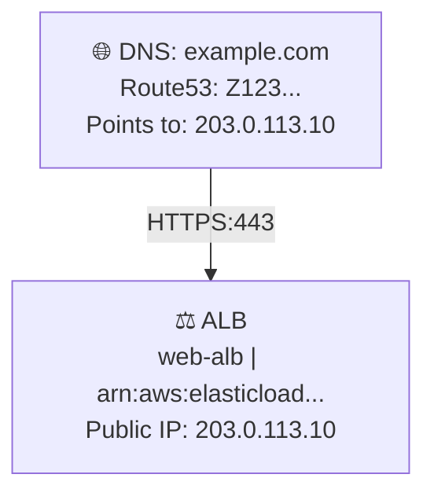
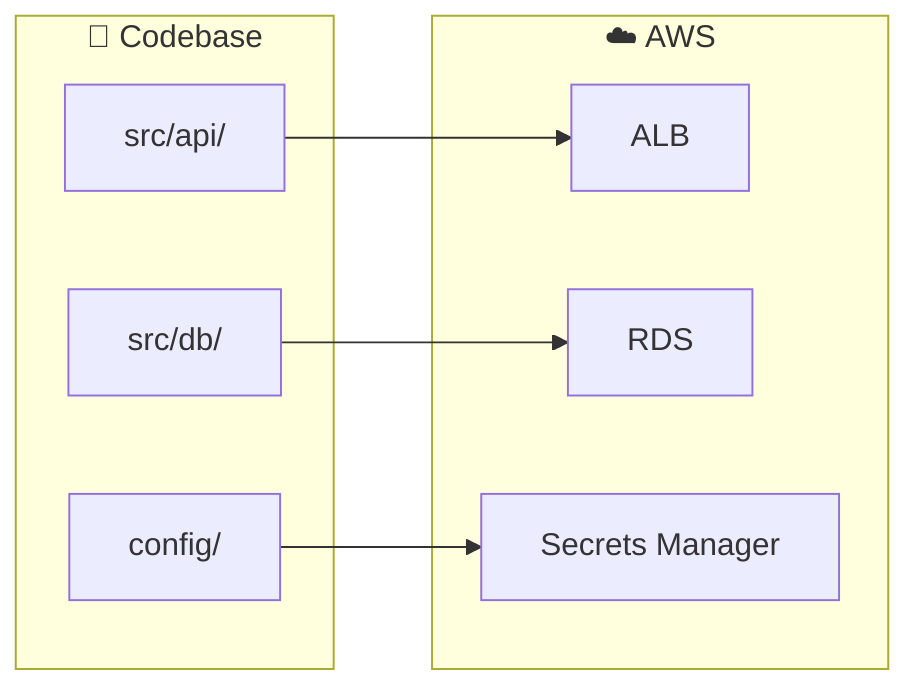
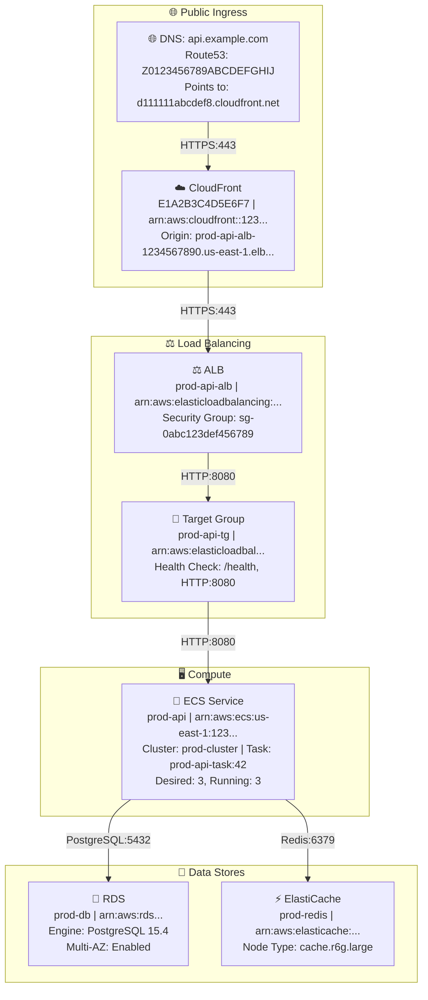
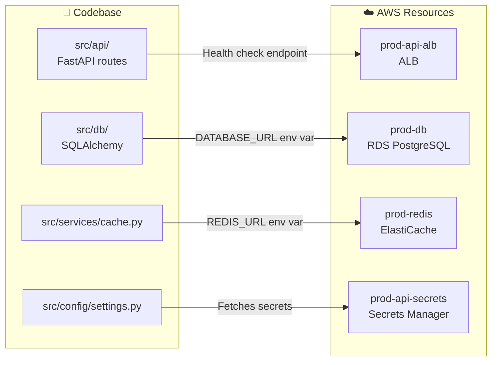

# Architecture Documentation

## Overview

This SOP documents AWS infrastructure architecture by generating comprehensive, verified documentation including visual diagrams and detailed component descriptions. The documentation covers the complete data flow from ingress points (DNS, public IPs, load balancers) through compute and storage layers, with precise resource names, IDs, and ARNs. 

The SOP combines two sources of truth:
1. **Live AWS data** - Verified infrastructure configuration from AWS APIs
2. **Codebase analysis** - Application code, deployment configurations, and infrastructure-as-code that reveals how the application connects to AWS services

All AWS information must be verified against live data—no fabrication or inference is permitted. Codebase insights are used to enrich the documentation with application context.

Architecture diagrams use Mermaid flowchart syntax for rendering in GitHub, GitLab, and other markdown viewers that support Mermaid.

## Parameters

- **target_service** (required): The AWS service, workload, or application to document (e.g., "production ECS service", "web application load balancer", "order processing pipeline")
- **codebase_path** (optional, default: current directory): Path to the application codebase to analyze for architecture context
- **aws_profiles** (optional): List of AWS profiles to use for resource discovery. If not specified, all available profiles are used
- **output_format** (optional, default: "full"): Level of detail - "full" (all four blocks), "summary" (blocks 1, 2, and 3 only), "diagram_only" (block 2 only)
- **include_connectivity_tests** (optional, default: true): Whether to perform DNS and connectivity verification tests
- **output_path** (optional, default: "docs/architecture"): Directory path where the architecture documentation will be saved
- **pr_branch** (optional, default: "docs/architecture-{service-slug}-{timestamp}"): Branch name for the PR

**Constraints for parameter acquisition:**
- You MUST ask for the target_service upfront if not provided
- You MUST clarify ambiguous service names (e.g., "the API" could refer to multiple services)
- You MUST confirm the AWS account and region scope if multiple are available
- You MUST validate that AWS credentials are available before proceeding
- You MUST validate that the codebase_path exists and is accessible

## Steps

### 1. Check for Existing Documentation

Check if architecture documentation already exists in the repository for the requested service.

**Constraints:**
- You MUST check if documentation already exists at the output_path location
- If existing documentation is found:
  - You MUST validate it against live AWS data
  - If no discrepancies exist, confirm the documentation is current
  - If discrepancies exist, proceed to generate updated documentation
- If no documentation exists, proceed to discover and document the architecture
- You MUST NOT invent or fabricate architecture information
- You MUST NOT ask clarifying questions at this stage

### 2. Discover Ingress Points and Entry Flow

Identify how traffic enters the system, starting from DNS and public-facing resources.

**Constraints:**
- You MUST start discovery from the real ingress point
- You MUST check for these ingress types in order:
  1. **DNS & Public IPs**: Query Route53 hosted zones, check ALB/NLB/CloudFront for public IPs and DNS names
  2. **Internet-facing**: CloudFront distributions, ALB/NLB (public), API Gateway, Internet Gateway → public subnets
  3. **Private/internal**: VPC Endpoints, AWS PrivateLink, Transit Gateway/Peering, VPN, Direct Connect
  4. **Event-driven**: EventBridge rules, S3 event notifications, SNS/SQS triggers, IoT rules, CodePipeline
- You MUST resolve DNS names and verify they point to the expected resources
- You MUST verify service availability for public endpoints
- You MUST verify SSL/TLS certificates for HTTPS endpoints
- If multiple ingress paths exist, you MUST document each separately
- You MUST NOT assume or infer ingress points—only document verified information

### 3. Discover Service Connections and Dependencies

Trace the data flow from ingress through all connected services to datastores.

**Constraints:**
- You MUST identify service connections using these methods:
  - **Security group rules**: Analyze ingress/egress for ports, protocols, source/destination security groups
  - **Environment variables**: Check ECS task definitions, Lambda configurations, ASG launch templates for service references
  - **IAM roles/policies**: Examine permissions to identify connected services (S3, DynamoDB, SQS, SNS, etc.)
  - **Event source mappings**: Check Lambda triggers (DynamoDB streams, Kinesis, SQS)
  - **Service discovery**: Check ECS Service Connect, Cloud Map for DNS names
- You MUST fetch live AWS configuration to verify current state
- You MUST NOT invent or infer components, names, IDs, ARNs, settings, or relationships
- If information cannot be found after reasonable lookups, you MUST write `unknown` and note what was attempted

### 4. Analyze Codebase for Architecture Context

Inspect the application codebase to understand how the code relates to the AWS infrastructure.

**Constraints:**
- You MUST analyze the codebase to identify:
  - **Infrastructure-as-Code**: Terraform files, CloudFormation templates, CDK code, SAM templates
  - **Deployment configurations**: Dockerfiles, docker-compose files, ECS task definitions, Kubernetes manifests
  - **Application configuration**: Environment variable usage, configuration files, secrets references
  - **AWS SDK usage**: How the application connects to AWS services (S3 clients, DynamoDB tables, SQS queues)
  - **Database connections**: Connection strings, ORM configurations, migration files
  - **API definitions**: OpenAPI/Swagger specs, GraphQL schemas, REST endpoint definitions
- You MUST identify file organization, directory structure, and architectural patterns
- You MUST document the technology stack and dependencies (package.json, requirements.txt, go.mod, etc.)
- You MUST correlate codebase findings with discovered AWS resources:
  - Match environment variables in code to actual AWS resource names/ARNs
  - Identify which code modules interact with which AWS services
  - Map deployment configurations to running infrastructure
- You MUST create a hierarchical map of how the codebase components relate to AWS services
- You MUST use Mermaid diagrams for visualizing code-to-infrastructure relationships
- You MUST NOT fabricate connections—only document what is explicitly defined in code
- If codebase_path is not provided or not accessible, you MUST note this limitation and proceed with AWS-only documentation

### 5. Generate Architecture Documentation

Create comprehensive documentation following the strict four-block output format.

**Constraints:**
- You MUST produce exactly four blocks in this order:

**Block 1: What this describes**
- One paragraph summarizing: workload/service name, environment, AWS account ID (full 12 digits), regions, primary ingress type(s)
- You MUST include the complete account ID, not masked or abbreviated

**Block 2: Architecture template with names and identifiers**
- Top-to-bottom flow diagram using Mermaid flowchart syntax
- Start with DNS/public IPs at the top, flow downward
- Each component as a node with format: `ComponentType<br/>Name | ID/ARN`
- Include ports/protocols as edge labels between components
- For load balancers, show listener rules and target groups as separate nodes
- For multiple paths, use subgraphs or parallel branches
- You MUST use Mermaid flowchart format:


**Block 3: Detailed architecture**
- Clear walkthrough with subsections per major component:
  - **DNS & Public Access**: Route53 zones, records, public IPs on load balancers/CloudFront/Elastic IPs
  - **Networking**: VPC (name, ID, CIDR), subnets (IDs, AZs, public/private), route tables, IGW/NAT, VPC endpoints, security groups/NACLs
  - **Ingress/Edge**: CloudFront/ALB/NLB/API Gateway (listeners, protocols, target groups, WAF, DNS names, IPs)
  - **Compute**: EC2/ASG, ECS, EKS, Lambda (key configs, scaling, triggers)
  - **Data**: RDS/Aurora, DynamoDB, ElastiCache, S3, OpenSearch (engines, Multi-AZ, encryption)
  - **IAM & Secrets**: Key roles/policies, KMS keys, Secrets Manager/Parameter Store references
  - **Reliability & Ops**: Multi-AZ/HA, backups, DLQs, retries, health checks, autoscaling policies
  - **Observability & Security**: CloudWatch logs/metrics, X-Ray, alarms, WAF rules, GuardDuty
- You MUST include concrete names and IDs/ARNs for every resource
- You MUST label any unknown fields as `unknown (could not be retrieved)`

**Block 4: Codebase context**
- Application-level details that connect code to infrastructure:
  - **Technology Stack**: Programming languages, frameworks, runtime versions
  - **Project Structure**: Key directories and their purposes, module organization
  - **Infrastructure-as-Code**: Location of Terraform/CloudFormation/CDK files, key resource definitions
  - **Deployment Configuration**: Dockerfile locations, container configurations, CI/CD pipeline references
  - **AWS Service Integration**: Which code modules use which AWS services, SDK configurations
  - **Configuration Management**: Environment variables used, config file locations, secrets references
  - **Database Layer**: ORM/database client configurations, migration file locations, connection patterns
  - **API Layer**: Endpoint definitions, route handlers, API documentation locations
- You MUST include file paths relative to codebase root
- You MUST correlate code components with AWS resources from Block 3
- You MUST use Mermaid diagrams to show code-to-infrastructure mapping:

- If codebase was not analyzed, you MUST note "Codebase analysis not performed" and explain why

### 6. Save Documentation and Create Pull Request

Save the architecture documentation to the repository and create a pull request for review.

**Constraints:**
- You MUST generate a descriptive filename from the "What this describes" section (3-5 key words, slugified, e.g., `prod-api-ecs-service.md`)
- You MUST save the documentation file to the output_path directory
- You MUST create a new branch using the pr_branch parameter
- You MUST commit the documentation file with a descriptive commit message
- You MUST create a pull request with:
  - Title: "docs: Add architecture documentation for {target_service}"
  - Description including:
    - Summary of the documented architecture
    - AWS accounts and regions covered
    - List of components documented
    - Any areas marked as `unknown` that may need manual verification
- You MUST provide the PR URL to the user
- You MUST NOT merge the PR automatically—it must be reviewed and merged manually

### 7. Present Results and Summary

Provide a summary of the documentation process and next steps.

**Constraints:**
- You MUST present all four blocks (or requested subset based on output_format)
- You MUST include metadata about the documentation:
  - AWS accounts and regions covered
  - Codebase path analyzed (if applicable)
  - Timestamp of documentation generation
  - Pull request URL and status
  - File path where documentation was saved
  - Any areas where data could not be retrieved
- You MUST highlight any areas marked as `unknown` that may require manual investigation
- You MUST summarize key findings from codebase analysis if performed
- You MUST provide guidance on reviewing and merging the PR
- You MUST NOT include recommendations or suggestions unless explicitly requested
- You MUST NOT modify or embellish the verified data

## Mermaid Diagram Conventions

When creating Block 2 architecture diagrams, follow these conventions:

### Node Formatting
- Use descriptive node IDs (e.g., `DNS`, `ALB`, `ECS`, `RDS`)
- Include emoji prefixes for visual clarity:
  - 🌐 DNS/Internet
  - ☁️ CloudFront/CDN
  - ⚖️ Load Balancers
  - 🎯 Target Groups
  - 🐳 Container services (ECS/EKS)
  - λ Lambda functions
  - 🖥️ EC2/Compute
  - 💾 Data stores (general)
  - 🐘 PostgreSQL/RDS
  - ⚡ ElastiCache/Redis
  - 📦 S3
  - 📊 DynamoDB
  - 📁 Codebase/Directory
  - 🐍 Python code
  - 📜 JavaScript/TypeScript code
  - ⚙️ Configuration files
  - 🔧 Infrastructure-as-Code
- Use `<br/>` for line breaks within nodes
- Include both name and ID/ARN in each node (for AWS resources)
- Include file paths relative to codebase root (for code components)

### Edge Labels
- Always include port and protocol: `|"HTTPS:443"|`
- Use quotes around labels with special characters

### Subgraphs
- Group related components (Ingress, Load Balancing, Compute, Data)
- Use descriptive titles with emoji prefixes
- Keep subgraph nesting to maximum 2 levels

### Flow Direction
- Use `flowchart TB` (top-to-bottom) for primary diagrams
- Use `flowchart LR` (left-to-right) for wide architectures with many parallel paths

## Examples

### Example Input
```
target_service: "production-api ECS service"
codebase_path: "/path/to/api-service"
aws_profiles: ["production", "shared-services"]
output_format: "full"
include_connectivity_tests: true
output_path: "docs/architecture"
pr_branch: "docs/architecture-prod-api-ecs"
```

### Example Output (Block 1)
```
## 1) What this describes
This documents the production API service running on Amazon ECS in AWS account 123456789012 (us-east-1). 
The service handles REST API requests through an Application Load Balancer with CloudFront distribution 
for caching and DDoS protection. Primary ingress is via CloudFront and ALB; the service connects to 
RDS PostgreSQL for persistence and ElastiCache Redis for session caching.
```

### Example Output (Block 2)

## 2) Architecture template with names and identifiers



### Example Output (Block 3 Excerpt)
```
## 3) Detailed architecture

### DNS & Public Access
- **Route53 Hosted Zone**: Z0123456789ABCDEFGHIJ (example.com)
- **A Record**: api.example.com → ALIAS to CloudFront distribution d111111abcdef8.cloudfront.net
- **CloudFront Distribution**: E1A2B3C4D5E6F7
  - Origin: prod-api-alb-1234567890.us-east-1.elb.amazonaws.com
  - SSL Certificate: arn:aws:acm:us-east-1:123456789012:certificate/abc-123
  - Cache Policy: CachingDisabled (API traffic)
  - WAF: arn:aws:wafv2:us-east-1:123456789012:regional/webacl/prod-api-waf/...

### Networking
- **VPC**: prod-vpc (vpc-0abc123def456789a) | CIDR: 10.0.0.0/16
- **Subnets**:
  - Private: subnet-0aaa111... (us-east-1a), subnet-0bbb222... (us-east-1b)
  - Public: subnet-0ccc333... (us-east-1a), subnet-0ddd444... (us-east-1b)
- **Security Groups**:
  - ALB (sg-0abc123...): Ingress 443 from 0.0.0.0/0, Egress 8080 to sg-0def456...
  - ECS (sg-0def456...): Ingress 8080 from sg-0abc123..., Egress 5432/6379 to datastores

### Compute
- **ECS Cluster**: prod-cluster (arn:aws:ecs:us-east-1:123456789012:cluster/prod-cluster)
- **ECS Service**: prod-api
  - Task Definition: prod-api-task:42
  - Launch Type: FARGATE
  - CPU: 1024, Memory: 2048
  - Desired Count: 3
  - Auto Scaling: Target tracking on ECSServiceAverageCPUUtilization (target: 70%)

[... additional sections ...]
```

### Example Output (Block 4)
```
## 4) Codebase context

### Technology Stack
- **Language**: Python 3.11
- **Framework**: FastAPI 0.104.1
- **Runtime**: Docker container on ECS Fargate

### Project Structure
```
api-service/
├── src/
│   ├── api/           # FastAPI route handlers
│   ├── db/            # SQLAlchemy models and repositories
│   ├── services/      # Business logic
│   └── config/        # Configuration management
├── infra/
│   └── terraform/     # Infrastructure-as-code
├── Dockerfile
└── docker-compose.yml
```

### Infrastructure-as-Code
- **Location**: `infra/terraform/`
- **Key Resources**:
  - `ecs.tf` - ECS cluster, service, task definition
  - `alb.tf` - Application Load Balancer configuration
  - `rds.tf` - PostgreSQL RDS instance
  - `elasticache.tf` - Redis cluster

### AWS Service Integration



### Configuration Management
- **Environment Variables** (from `src/config/settings.py`):
  - `DATABASE_URL` → RDS PostgreSQL connection string
  - `REDIS_URL` → ElastiCache Redis endpoint
  - `AWS_REGION` → us-east-1
- **Secrets**: Retrieved from Secrets Manager `prod-api-secrets`

### Database Layer
- **ORM**: SQLAlchemy 2.0
- **Models**: `src/db/models/` - User, Order, Product entities
- **Migrations**: Alembic migrations in `src/db/migrations/`
- **Connection**: AsyncPG driver for PostgreSQL

### API Layer
- **Framework**: FastAPI with automatic OpenAPI documentation
- **Routes**: `src/api/routes/` - REST endpoints for /users, /orders, /products
- **Documentation**: Auto-generated at `/docs` (Swagger UI)
```

## Troubleshooting

### Missing Resource Information
If some resource data cannot be retrieved:
- Verify AWS credentials have sufficient permissions (describe/list actions)
- Check if resources exist in the specified regions
- Try broader search terms or different query approaches
- Document missing fields as `unknown (could not be retrieved)`

### Multiple Ingress Paths
When a service has multiple entry points:
- Document each path using Mermaid subgraphs or parallel branches in Block 2
- Clearly label which path serves which purpose using subgraph titles (e.g., "Public API", "Internal Admin")
- Include all paths in the Block 3 detailed documentation

### Cross-Account Resources
When architecture spans multiple AWS accounts:
- Use multiple AWS profiles for discovery
- Clearly indicate account ID for each resource
- Document cross-account IAM roles and trust relationships

### Large Architectures
For complex systems with many components:
- Focus on the primary data path first
- Add secondary paths and supporting services
- Consider breaking into logical sections if documentation exceeds reasonable length

### Outdated Documentation
If existing documentation in the repo is outdated:
- Always validate against live AWS data
- Regenerate documentation if significant discrepancies are found
- The PR will show diff highlighting what changed

### Codebase Analysis Issues
If codebase analysis produces incomplete results:
- Verify the codebase_path is correct and accessible
- Check that the codebase contains standard configuration files (package.json, requirements.txt, etc.)
- Look for non-standard directory structures that may require manual mapping
- Document any modules or components that could not be analyzed

### Correlating Code to Infrastructure
If code-to-AWS correlations are unclear:
- Check environment variable names in code against ECS task definitions or Lambda configs
- Look for infrastructure-as-code files (Terraform, CloudFormation) that define the resources
- Review CI/CD pipeline configurations for deployment mappings
- Note any correlations that could not be verified

### PR Creation Issues
If PR creation fails:
- Verify that you have write permissions to the repository
- Check that the branch name is valid and doesn't already exist
- Ensure all documentation files were successfully generated before PR creation
- Verify that the base branch (main) exists and is accessible

